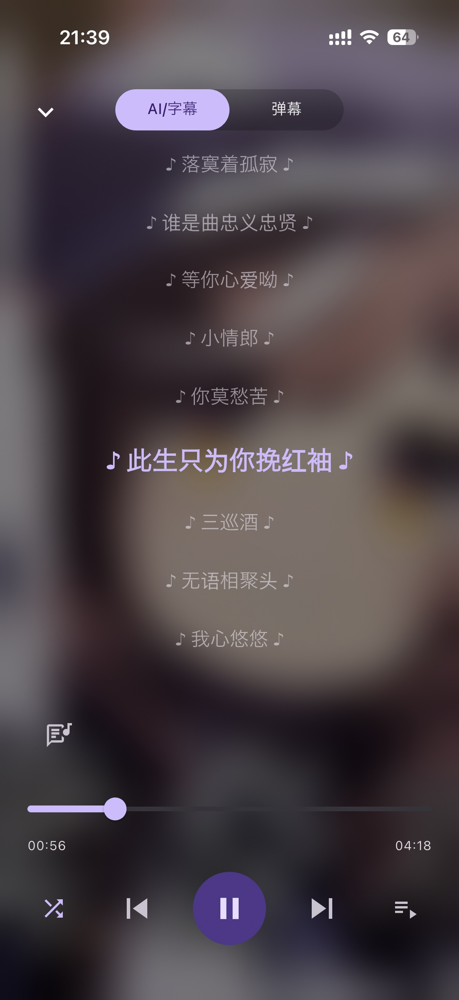
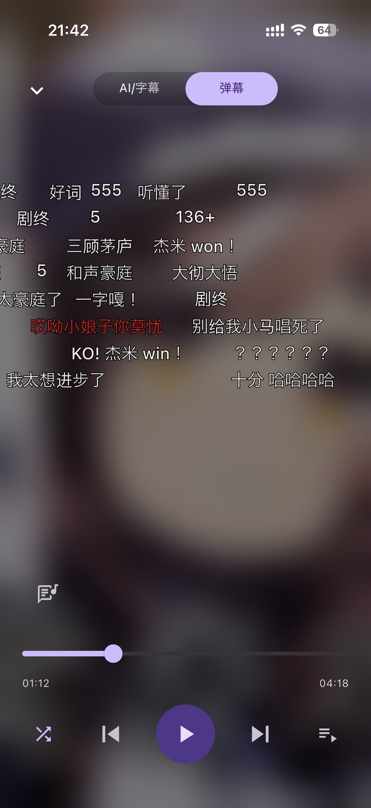
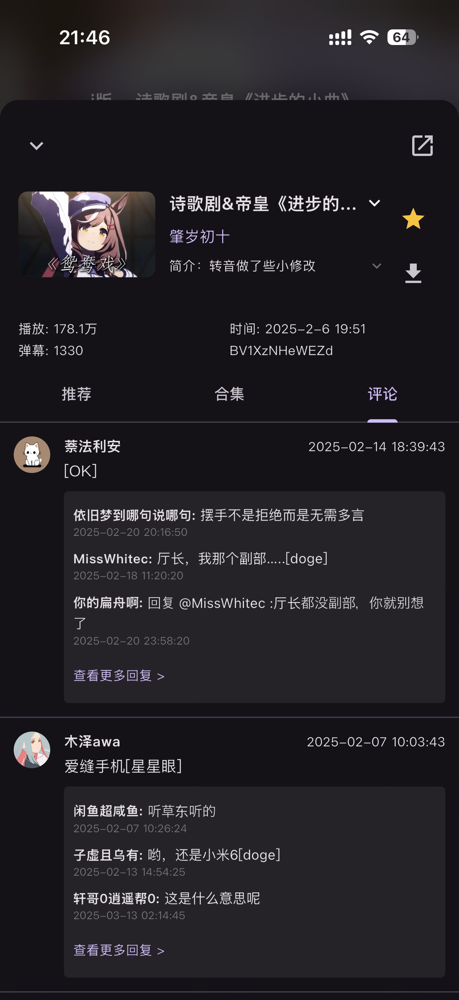

# Utopia Music

> Another Unofficial Cross-Platform Bilibili Music Client

这是一个以纯粹音乐播放为理念核心的B站第三方客户端，仅支持音频，你可以拿来听歌，听书，抑或是睡前听点长视频助眠。  
 
**界面设计效果见底部[UI/UX Demo](#uiux-demo)**  
 
本项目适用平台：iOS，Android，macOS，Windows，Linux。目前，我将会把主要精力放在移动端样式适配上，希望使用桌面端的可以尝试[Biu](https://github.com/wood3n/biu)
，完成度真的很高。  
 
警告：本项目大量使用Gemini等生成式AI。  
我本人移动端上此前只做过原生安卓开发和安卓OS开发，对flutter可以说是一窍不通，因此本项目基本vibecode。  
开发工具：idea + Gemini Code Assist插件  
 
20260128 做人做企业不能忘本，向已死的互联网海盗精神致敬。  
 
20260130：尝试了一下Antigravity + Claude Opus 4.5，我只能说这个太好用了，又快又准，帮我重构和实现了好多功能，太无敌了。  

## 下载

[最新测试版](https://github.com/UtopiaXC/UtopiaMusic/releases)

## 演示视频

https://github.com/user-attachments/assets/c3ec56c8-a1ac-4c35-a854-1f594685f820

## 开发初衷

最近用了 [Biu](https://github.com/wood3n/biu) 和 [BBPlayer](https://github.com/bbplayer-app/BBPlayer)，发现两个应用都很优秀。可惜Biu用的
Electron 只支持桌面端，BBPlayer虽然是React Native
Expo开发的，但是我尝试打包成iOS的ipa的时候发现作者在播放引擎上针对安卓做了优化，在iOS上用不了，我尝试替换了一下播放库，结果还是不行，遂作罢。查了半天，发现好多人都做过flutter版的bili
music，但是没有找到符合我使用习惯的，于是自己开发一个。
 
（笑死我不会说我是为了用CarPlay听小马音乐才开发的这个，推荐收听：[小马の音乐](https://space.bilibili.com/283351624/lists/4012940?type=season)）

## 参考与感谢

[SocialSisterYi/bilibili-API-collect](https://github.com/SocialSisterYi/bilibili-API-collect)  
[wood3n/biu](https://github.com/wood3n/biu)  
[bbplayer-app/BBPlayer](https://github.com/bbplayer-app/BBPlayer)  
[guozhigq/pilipala](https://github.com/guozhigq/pilipala)
[bggRGjQaUbCoE/PiliPlus](https://github.com/bggRGjQaUbCoE/PiliPlus)

## 引用的开源许可证

见应用内设置页详情选项。

## 社区协作

本项目欢迎贡献代码。  
欢迎AI代码。但是提交AI代码前请务必人工审阅。  
请遵守社区规则提交issue与PR。

## 捐助

请不要在任何渠道以任何方式为本项目付出金钱。  
如果您想捐助本项目，您可以向慈善组织或开放源代码促进会（开源组织，OSI）捐款，我们会感激不尽。

## 用户协议与免责声明 / EULA

[EULA](assets/documentations/EULA.md)

## UI/UX Demo

| 播放器                                      | 发现                                           | 曲库                                         | 设置                                           |
|------------------------------------------|----------------------------------------------|--------------------------------------------|----------------------------------------------|
|  |  |  |  |

| AI/字幕                                          | 弹幕                                         | 用户主页                                             | 系统播放控件（iOS）                                                    |
|------------------------------------------------|--------------------------------------------|--------------------------------------------------|----------------------------------------------------------------|
|  |  |  |  |

| 视频详情/相关推荐                                            | 所属合集/分P                                                        | 评论区                                          | 收藏集/本地歌单                                       |
|------------------------------------------------------|----------------------------------------------------------------|----------------------------------------------|------------------------------------------------|
|  |  |  |  |
