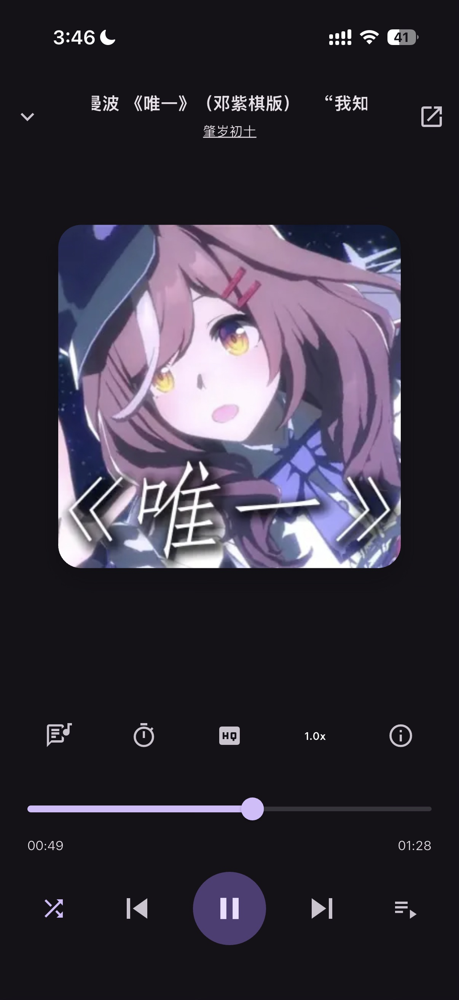
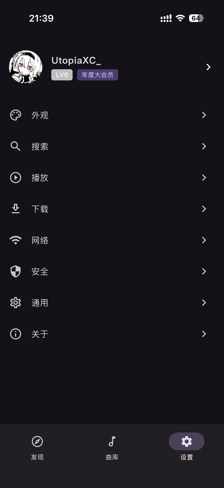
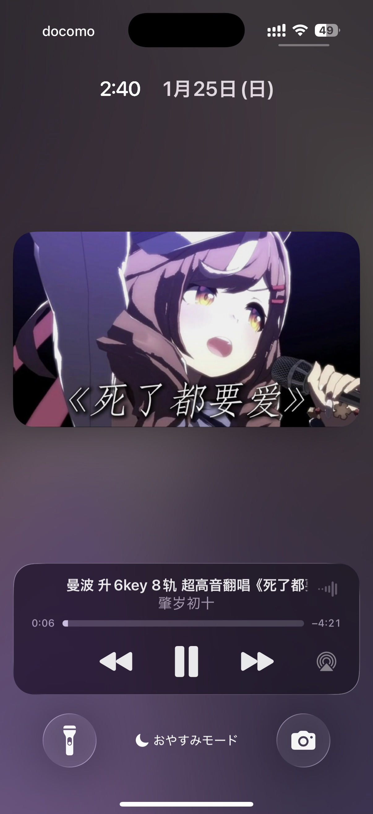

# Utopia Music - Another Unofficial Cross-Platform Bilibili Music Client

## WIP

> 目前仍在验证开发阶段，请等待测试版发布

开发初衷：最近用了 [Biu](https://github.com/wood3n/biu) 和 [BBPlayer](https://github.com/bbplayer-app/BBPlayer)
，发现两个应用都很优秀。可惜Biu用的 Electron 只支持桌面端，BBPlayer虽然是React Native
Expo开发的，但是我尝试打包成iOS的ipa的时候发现作者在播放引擎上针对安卓做了优化，在iOS上用不了，我尝试替换了一下播放库，结果还是不行，遂作罢。查了半天，发现好多人都做过flutter版的bili
music，但是没有找到符合我使用习惯的，于是自己开发一个。  
 
移动端上此前只做过原生安卓开发和安卓OS开发，对flutter可以说是一窍不通，但是AI时代确实大大降低了简单项目的开发难度，一个小时就把框架搭起来了。  
 
目前，我将会把主要精力放在移动端样式适配上，希望使用桌面端的可以尝试[Biu](https://github.com/wood3n/biu)，完成度真的很高。  
 
本项目适用平台：iOS，Android，macOS，Windows，Linux。Web端由于CORS限制暂不考虑。  
 
警告：本项目大量使用Gemini等生成式AI。开发工具：idea + Gemini Code Assist插件  
 
（我不会说我就是为了用CarPlay听小马音乐才开发的这个，乐）  
 

## 下载

目前仍处于开发阶段，请不要提交关于稳定性和功能不可用相关的issue，如果您有UI/UX的建议欢迎提交issue。  
[开发测试版](https://github.com/UtopiaXC/UtopiaMusic/releases)

## UI/UX Demo

| 播放器                                      | 发现                                           | 详情                                             | 曲库                                         |
|------------------------------------------|----------------------------------------------|------------------------------------------------|--------------------------------------------|
|  |  |  |  |

| 设置                                         | 收藏夹                                           | 用户主页                                    | 系统播放控件                                               |
|--------------------------------------------|-----------------------------------------------|-----------------------------------------|------------------------------------------------------|
|  |  |  |  |

## 参考与感谢

[SocialSisterYi/bilibili-API-collect](https://github.com/SocialSisterYi/bilibili-API-collect)  
[wood3n/biu](https://github.com/wood3n/biu)  
[bbplayer-app/BBPlayer](https://github.com/bbplayer-app/BBPlayer)  
[bggRGjQaUbCoE/PiliPlus](https://github.com/bggRGjQaUbCoE/PiliPlus)

## 引用的开源许可证

见应用内设置页详情选项。

## 社区协作

本项目欢迎贡献代码。  
不拒绝AI代码。但是提交AI代码前请务必人工审阅。  
请遵守社区规则提交issue与PR。

## 捐助

请不要在任何渠道以任何方式为本项目付出金钱。  
如果您想捐助本项目，您可以向慈善组织或开放源代码促进会（开源组织，OSI）捐款，我们会感激不尽。

## 用户协议与免责声明 / EULA

[EULA.md](assets/documentations/EULA.md)